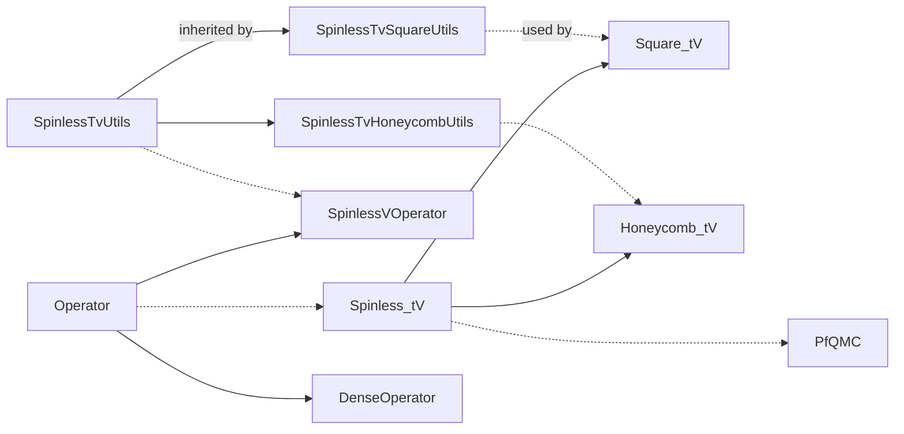

# Pfaffian Quantum Monte Carlo (PfQMC)

A prototype implementation of the Pfaffian Quantum Monte Carlo (PfQMC) algorithm for simulating fermionic quantum many-body systems. This repository implements the spinless t-V model with possible p+ip pairing term, and the interacting Kitaev chain.

Check on our paper [arXiv:2408.10311](https://arxiv.org/abs/2408.10311) for a complete description of the algorithm and related derivations.

## Usage


The repo relies on the [PFAPACK](https://arxiv.org/abs/1102.3440) for Pfaffian-related calculations, included in `inc/pfapack`. [Eigen](https://eigen.tuxfamily.org/) library, along with the Intel® oneAPI Math Kernel Library ([oneMKL](https://www.intel.com/content/www/us/en/developer/tools/oneapi/onemkl.html)) is used for matrix operations.

To build with CMAKE,
```bash
# build PFAPACK first with your favorite fortran compiler (ifx here)
cd inc/pfapack/fortran && make mFC=ifx && cd ../c_interface && make

# run setvars.sh in the Intel oneAPI directory,
# mkl dependencies should be automatically located
mkdir build && cd build
cmake .. -DEIGEN3_INCLUDE_DIR=/path/to/eigen3 & make
```

See `.github/workflows/main.yml` for a complete build and test workflow.

## Program Design


