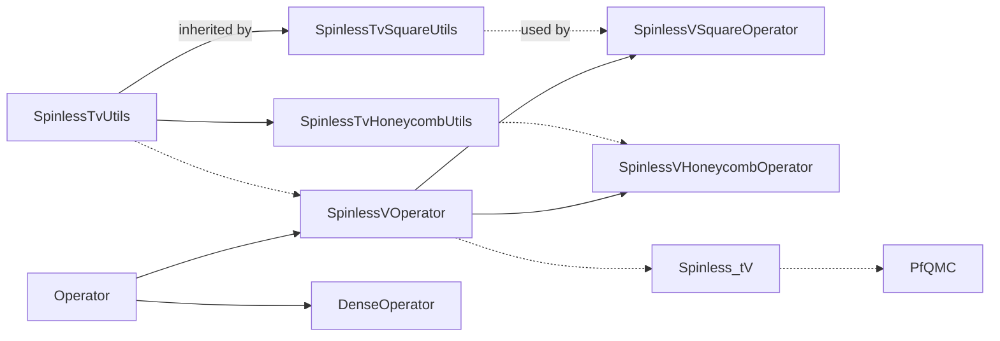

# MajoranaQMC

usage:

```bash
# setvars for mkl first, 
# mkl dependencies should be automatically located
mkdir build && cd build
cmake .. -DEIGEN3_INCLUDE_DIR=/path/to/eigen3 & make
```

or:

```bash
mkdir obj && mkdir bin
make EIGEN3_INCLUDE_DIR=/path/to/eigen3
```

## Program Design

